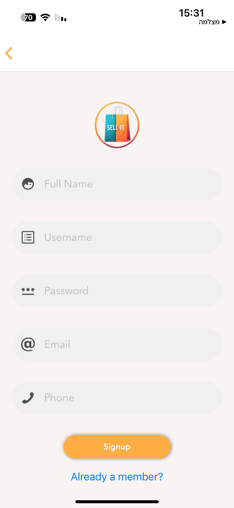
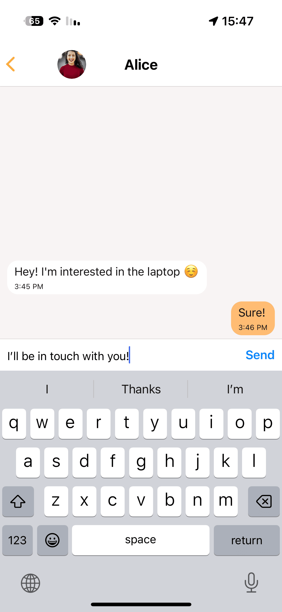

# Sell It 🛒

Sell It is a React Native application that serves as a second-hand selling platform. Built with Expo and connected to an Express backend using Apisauce, Sell It provides a seamless user experience for buying and selling used items.

## Overview 📋

Sell It offers a full-featured marketplace where users can list items for sale, communicate with potential buyers or sellers via chat, and receive real-time notifications through Expo Notifications. The app utilizes several databases to manage different types of data, ensuring organized and efficient data handling.

## Features ⭐

- **Second-Hand Marketplace**: Easily list, browse, and purchase second-hand items.
- **User Management**: Secure user registration, authentication, and profile management.
- **Item Database**: Manage all the items available for sale.
- **Chat System**: Real-time messaging between buyers and sellers.
- **Message Database**: Stores individual chat messages.
- **Express Backend Integration**: Seamless API communication via [Apisauce](https://github.com/infinitered/apisauce).
- **Expo Environment**: Built with Expo for an efficient development and deployment workflow.
- **Expo Notifications**: Integrated push notifications for messaging updates.

## Architecture 🏗️

The application is structured around several key components:

- **Databases**:
  - **Item**: Contains information about each product listed for sale.
  - **User**: Manages user profiles and authentication details.
  - **Chat**: Organizes conversation threads between users.
  - **Message**: Stores individual messages within each chat.
- **Backend Communication**:
  - Uses Apisauce to interact with an Express backend. You can find the backend source code on [GitHub](https://github.com/dorhakim100/Sell-It-Backend).
- **Development Environment**:
  - Developed with Expo, which simplifies the building, testing, and deployment of React Native apps.
- **Notifications**:
  - Utilizes Expo Notifications to deliver real-time alerts for chat messages and updates.

## Installation 💻

Follow these steps to get your development environment set up:

1. **Clone the Repository**

   ```bash
   git clone <repository-url>
   cd sell-it
   ```

2. **Install Dependencies**

   ```bash
   npm install
   ```

   or if you prefer yarn:

   ```bash
   yarn install
   ```

3. **Start the Expo Server**
   ```bash
   expo start
   ```

## Configuration ⚙️

- **Express Backend**: Ensure your Express backend is running and accessible. For the backend source code, visit the [Sell It Backend Repository](https://github.com/dorhakim100/Sell-It-Backend).
- **Expo Notifications**: Configure your push notifications settings as per the [Expo Notifications documentation](https://docs.expo.dev/push-notifications/overview/).

## Usage 🔑

- Launch the app using Expo on your device or emulator.
- Register or log in to access the marketplace features.
- Create, browse, and interact with items listed for sale.
- Use the integrated chat system to communicate with other users.
- Receive notifications for new messages and other relevant updates.

## Screenshots 📸

Here are some screenshots from the project:

### Home Screen


### Sign-Up Screen



### Explore Screen


### Item Screen


### Chats Screen


### Messaging Screen



### Add Item Screen


### Profile Screen


## Contact ✉️

For any questions or issues, please feel free to contact me.
